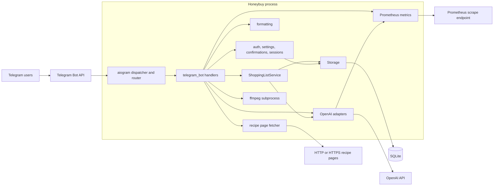

# Architecture

## System Context

Honeybuy's request-serving runtime is a single Python process. Aiogram
long-polls Telegram and
dispatches updates to handlers built inside `build_dispatcher`. The handlers
authorize the request, call domain or infrastructure helpers, persist state in
SQLite, and send or edit Telegram messages.



There is no webhook server or application HTTP API. The only optional HTTP
listener is the Prometheus exporter.

## Entrypoints And Startup

The package has two equivalent runtime entrypoints:

- The `honeybuy-tg` console script declared in
  [`pyproject.toml`](../pyproject.toml) calls `honeybuy_tg.main`.
- `python -m honeybuy_tg` runs
  [`src/honeybuy_tg/__main__.py`](../src/honeybuy_tg/__main__.py).

Both reach `app.main` in
[`src/honeybuy_tg/app.py`](../src/honeybuy_tg/app.py). Startup proceeds as
follows:

1. Inspect the command-line arguments.
2. For `migrate` or `healthcheck`, load only `DATABASE_PATH`, perform the
   database command, and exit without loading bot settings or contacting the
   network.
3. With no arguments, load and validate the full `Settings` from the process
   environment and `.env`.
4. Configure process logging.
5. Start the Prometheus exporter if enabled.
6. Construct `Storage` and enter the asynchronous bot runtime.
7. `run_bot` initializes or migrates the database, creates the Telegram bot,
   registers slash-command suggestions, builds the dispatcher, and starts long
   polling.

Any other command-line arguments terminate with usage guidance.

## Manual Deployment

The operator selects, builds, and installs releases manually. CI runs offline
checks and has no deployment job.

The systemd template `deploy/systemd/honeybuy-tg.service` starts the release
selected by `/opt/honeybuy-tg/current` as the `honeybuy` user. Runtime secrets
come from `/etc/honeybuy-tg/env`, and SQLite stays outside release directories
under `/var/lib/honeybuy-tg`. Its `ExecStartPre` runs the application's
database-only health check. Migration is an explicit operator step before
starting a new release.

See [Operations And Testing](operations-and-testing.md#manual-ubuntu-deployment)
for the manual procedure.

## Module Boundaries

| Module | Responsibility | Important entry points |
| --- | --- | --- |
| `app.py` | Bot composition and database-only maintenance commands | `main` |
| `config.py` | Environment parsing, defaults, and owner validation | `Settings`, `load_settings` |
| `telegram_bot.py` | Aiogram routes, access checks, inline queries and callbacks, dependency construction, reply context, Telegram I/O, and voice conversion | `build_dispatcher`, `run_bot` |
| `service.py` | Shopping and recipe use cases, inline-item normalization, identity matching, backfill, and deduplication | `ShoppingListService` |
| `storage.py` | Concrete SQLite repository, expiring inline intents, and transaction-level invariants | `Storage` |
| `migrations.py` | Schema definition and `PRAGMA user_version` migration | `run_migrations`, `migrate_database_path` |
| `models.py` | Immutable domain values returned by storage and service layers | `ShoppingItem`, `Recipe`, `ItemIdentity` |
| `parser.py` | Deterministic Russian and English shopping-command parsing | `parse_shopping_text` |
| `recipes.py` | Deterministic recipe phrases, pasted-text recognition, and URL-to-visible-text conversion | `parse_learn_recipe_request`, `fetch_recipe_page_text` |
| `ai.py` | OpenAI transcription, parsing, extraction, categorization, normalization, and strict response schemas | `VoiceTranscriber`, parser/extractor classes |
| `formatting.py` | Pure user-facing list, recipe, and checklist rendering | `format_items`, `format_shop_session` |
| `metrics.py` | Prometheus counters, gauges, and timing helpers | `start_metrics_exporter`, recording helpers |
| `tracing.py` | Bounded typed request diagnostics and request-local correlation; no tenant authority | Routing trace lifecycle and safe event recording |

`telegram_bot.py` is deliberately broader than a thin controller. It constructs
all optional OpenAI clients, creates the service, defines handler-local helpers,
and talks directly to `Storage` for state coupled to Telegram delivery. Domain
shopping and recipe operations go through `ShoppingListService`.

## Dependency Direction

The primary dependency chain is:

```text
entrypoints
  -> app
    -> telegram_bot
      -> service
        -> storage
          -> migrations
          -> models
```

Supporting dependencies are one-way:

- `telegram_bot` uses `config`, `ai`, `parser`, `recipes`, `formatting`,
  `metrics`, and `models`.
- `service` uses domain models and storage.
- `storage` uses domain models and migrations.
- `ai` uses domain identity values and metrics.
- `formatting` uses domain models only.

Keep Telegram objects out of `service.py`, `storage.py`, and `models.py`. This
allows the domain and persistence behavior to be exercised without a live bot.

## External Boundaries

### Telegram

Aiogram supplies updates and Bot API calls. Command and callback handlers live
inside `build_dispatcher`, while `set_bot_commands` publishes the command menu.
The runtime uses long polling; group delivery of ordinary voice messages depends
on BotFather privacy-mode configuration.

Cross-chat capture uses Telegram inline mode, which an operator must enable
manually with `@BotFather` `/setinline`. A query such as `@HoneyBuyBot milk`
treats `milk` as one literal item and builds a personalized destination picker.
The private destination depends on the requester's configured access. Every
group destination must already be authorized, the bot must currently be an
administrator there, and the requester must currently be a member.

An inline update has no trusted source-chat tenant for this use case. The
Telegram layer therefore creates one opaque, requester-bound intent per offered
destination. The picker may show destination titles, but the card sent into
another conversation contains only generic confirmation text and the item; it
does not expose the destination or list contents. Selecting the result, and any
optional `chosen_inline_result` feedback, has no state effect. Only the explicit
inline-message callback can reach the service and storage apply path.
Callback `chat_instance`, inline-message ID, and visible card text are delivery
data, not destination authority.

At confirmation time the Telegram handler checks current capability before
normalization. The service performs the normal item-identity lookup without
reparsing or splitting the literal query, then invokes the Telegram-provided
guard to repeat the same private/group capability check immediately before
storage apply. This second gate closes the authorization race across
asynchronous normalization. Storage then rechecks the five-minute expiry and
target invariants while atomically claiming the intent, redacting its payload,
and inserting the shopping item. The generic success-card edit happens after
that commit, so Telegram edit failure cannot reopen or duplicate the mutation.

### OpenAI

All OpenAI access is isolated in [`ai.py`](../src/honeybuy_tg/ai.py). Each
adapter validates model output with a strict Pydantic schema before returning a
plain payload to the Telegram or service layer. One parse model is shared by
shopping parsing, recipe commands, extraction, categories, and item identity;
voice transcription has a separate model setting.

Most AI features degrade to deterministic or uncategorized behavior. New recipe
learning and voice transcription have no non-AI equivalent.

| Adapter | Metrics operation | Request limit | Caller fallback |
| --- | --- | --- | --- |
| `VoiceTranscriber` | `voice_transcription` | Audio limits are enforced by the Telegram layer | None; voice is rejected or fails |
| `ShoppingItemCategorizer` | `category_parse` | 600 output tokens | Cached categories or ungrouped items |
| `ShoppingItemNormalizer` | `item_normalize` | 900 output tokens | Cached or local item identity |
| `ShoppingTextParser` | `text_parse` | 700 output tokens | Deterministic parser on request/validation failure |
| `RecipeExtractor` | `recipe_extract` | 20,000 input characters and 2,500 output tokens | None; learning fails |
| `RecipeCommandParser` | `recipe_command_parse` | 500 output tokens | Deterministic recipe forms already ran first |

The five Responses API adapters use temperature zero and prompt the model to
return JSON, then validate the complete response text locally. They do not pass
an API structured-output schema. The application also does not configure an
OpenAI-specific timeout, retry, rate, or concurrency policy, so SDK defaults
apply. `build_dispatcher` currently constructs a separate `AsyncOpenAI` client
inside each enabled adapter.

Voice transcription supplies Russian as the language hint and a bilingual
shopping-command prompt. The post-transcription character limit is enforced
only after that request completes.

### SQLite

[`Storage`](../src/honeybuy_tg/storage.py) opens a connection per operation,
enables foreign keys for that connection, executes synchronous SQLite calls,
and commits explicitly. Selected multi-statement operations acquire
`BEGIN IMMEDIATE`; routine single-item operations use ordinary transactions.

### Files And Processes

Voice notes are downloaded to a temporary directory, converted from Telegram's
OGG/OPUS representation to WebM/Opus with `ffmpeg`, sent for transcription, and
removed when the temporary directory closes. The conversion has its own timeout
and subprocess cleanup path.

### Recipe Pages

The standard-library URL fetcher accepts HTTP and HTTPS responses whose content
type contains `html` or `text`, reads a bounded prefix, and reduces HTML to
visible text before extraction. Host trust and routing implications are covered
in [Ingestion And Recipes](ingestion-and-recipes.md).

## Where To Make A Change

- Add a slash command or callback: register it in `build_dispatcher`, update
  `set_bot_commands` and `help_text` where appropriate, then add Telegram tests.
- Add a shopping intent: extend `ParsedAction`, deterministic parsing, AI
  response schema/prompt, and `apply_parsed_command` together.
- Add a domain operation: put orchestration in `ShoppingListService` and data
  access in `Storage`; keep response wording in `formatting.py` or the handler.
- Add persistent state: create a new schema version and migration, expose it
  through storage methods, and test both a new database and an older shape.
- Add an AI operation: define a strict response model, wrap the request with AI
  metrics, handle failure at the calling boundary, and test malformed output.
- Change user-visible behavior: update the corresponding stable scenario in
  [`SCENARIOS.md`](../SCENARIOS.md) as well as code and tests.

## Current Scaling Assumptions

Incoming message diagnostics wrap message routing before handler selection.
Their request-local correlation is independent of authorization: persistence
and owner lookup always receive an explicit chat ID. Routing and AI boundaries
record finite codes and safe metadata in a dedicated short-lived trace store.
Diagnostics are best-effort and do not change product decisions, provider
prompts, or Prometheus label cardinality. See [Request Lifecycle](request-lifecycle.md)
for coverage and [Persistence](persistence.md) for retention.

The design assumes one low-volume bot process with a local SQLite file. The
following would need explicit architectural work before introducing batch
imports, multiple bot replicas, or high concurrency:

- synchronous SQLite calls currently run on the event-loop thread;
- there is no connection pool, WAL configuration, busy retry policy, or queue;
- multi-item shopping actions commit one item at a time;
- voice/recipe confirmations and tracked message context have no cleanup
  worker; inline-capture intents instead expire logically and are removed only
  when relevant persistence operations encounter them;
- caches and database state are local to one SQLite file.
