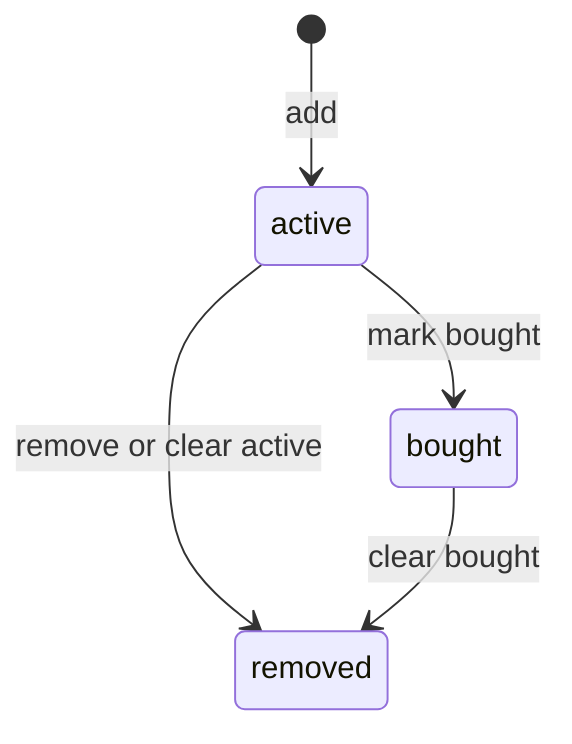

# Persistence

Honeybuy uses one SQLite database as its source of truth. The schema is defined
in [`migrations.py`](../src/honeybuy_tg/migrations.py), and all normal data
access goes through [`Storage`](../src/honeybuy_tg/storage.py).

## Connection Model

`Storage.connect` creates the database parent directory, opens a fresh
`sqlite3` connection, installs `sqlite3.Row`, and enables foreign keys. Most
public methods are declared `async` for their callers but execute synchronous
SQLite work directly and commit before returning.

This is appropriate for the current single-process, low-volume deployment. It
also means:

- database calls occupy the asyncio event-loop thread;
- SQLite's default journal, lock timeout, and isolation behavior apply;
- there is no connection pool, WAL setup, application busy retry, or write
  queue; and
- a second bot process would need careful coordination around polling and
  SQLite writes.

## Schema Overview

| Table | Scope/key | Purpose and lifecycle |
| --- | --- | --- |
| `authorized_chats` | `chat_id` | Groups explicitly authorized by the owner; authorization is upserted |
| `shopping_items` | generated `id`, every query constrained by `chat_id` | Active, bought, and removed item history; ordinary cleanup changes status rather than deleting rows |
| `events` | generated `id`, contains `chat_id` and `user_id` | Selective input, parse, and error diagnostics; not a complete audit log |
| `bot_messages` | `(chat_id, message_id)` | Telegram response kind and item IDs for reply-context actions |
| `pending_confirmations` | generated `id`, looked up with `chat_id` | Single-use voice and recipe-overwrite confirmation state encoded in JSON |
| `inline_capture_intents` | SHA-256 `token_hash`, every lookup also bound to `requester_id` | Expiring, single-use authority to add one literal item to an explicit private or authorized-group destination |
| `chat_settings` | `chat_id` | Per-chat natural-text parse-mode override |
| `category_cache` | normalized raw item name | Global, expiring AI category cache |
| `item_normalization_cache` | normalized raw item name | Global, expiring canonical grocery identity cache |
| `shop_sessions` | `(chat_id, message_id, item_id)` | Snapshot text, category, and checked state for a `/shop` message |
| `recipes` | generated `id`, unique `(chat_id, normalized_name)` | Chat-scoped recipe header, optional source URL, creator, and timestamps |
| `recipe_ingredients` | generated `id`, `recipe_id` foreign key | Ordered extracted ingredient names, quantity text, and canonical identity |
| `recipe_aliases` | generated `id`, unique `(chat_id, normalized_alias)` | Alternate chat-scoped recipe names; cascades with its recipe |

The only declared foreign keys are from `recipe_ingredients.recipe_id` and
`recipe_aliases.recipe_id` to `recipes.id`, both with `ON DELETE CASCADE`.
Application queries additionally enforce that an alias and its recipe have the
same `chat_id`; the database does not express that as a composite foreign key.

```mermaid
erDiagram
    RECIPES ||--o{ RECIPE_INGREDIENTS : contains
    RECIPES ||--o{ RECIPE_ALIASES : has

    AUTHORIZED_CHATS {
        integer chat_id PK
    }
    SHOPPING_ITEMS {
        integer id PK
        integer chat_id
        text status
        text canonical_key
    }
    BOT_MESSAGES {
        integer chat_id PK
        integer message_id PK
        text item_ids
    }
    PENDING_CONFIRMATIONS {
        integer id PK
        integer chat_id
        text status
        text items_json
    }
    INLINE_CAPTURE_INTENTS {
        text token_hash PK
        integer requester_id
        integer target_chat_id
        text target_kind
        text status
    }
    CHAT_SETTINGS {
        integer chat_id PK
    }
    SHOP_SESSIONS {
        integer chat_id PK
        integer message_id PK
        integer item_id PK
    }
    RECIPES {
        integer id PK
        integer chat_id
        text normalized_name
    }
    RECIPE_INGREDIENTS {
        integer id PK
        integer recipe_id FK
        integer position
    }
    RECIPE_ALIASES {
        integer id PK
        integer recipe_id FK
        integer chat_id
        text normalized_alias
    }
    EVENTS {
        integer id PK
        integer chat_id
        integer user_id
    }
    CATEGORY_CACHE {
        text normalized_name PK
    }
    ITEM_NORMALIZATION_CACHE {
        text raw_normalized_name PK
    }
```

The diagram shows declared recipe relationships. Other tables are associated by
stored Telegram or shopping-item IDs without foreign-key constraints.

## Chat Isolation

Shopping items, recipes, aliases, settings, voice/recipe confirmations,
bot-message context, and shop sessions are always read with a `chat_id`. A
Telegram message ID is only unique within its chat, which is why context and
sessions use composite keys.

Inline capture is deliberately different because Telegram inline queries can
originate outside a Honeybuy chat. Its intent stores an explicit target and is
looked up with both an opaque token hash and the requester ID. A private target
must equal that requester ID. A group target must still have a stored
`authorized_chats` row of type `group` or `supergroup` inside the apply
transaction; the Telegram layer separately rechecks current bot-admin and
requester-membership capability both before asynchronous item normalization and
again immediately afterward, just before calling storage.

Two caches are intentionally cross-chat:

- `category_cache` maps a normalized display name to a Russian grocery section;
- `item_normalization_cache` maps a normalized display name to canonical name
  and stable key.

Neither cache stores user attribution or list membership. Expired rows are
ignored by reads and may later be overwritten, but no job physically prunes
them.

When touching persistence directly, preserve these invariants:

- every recipe alias must use the same `chat_id` as its target recipe;
- statuses must remain values understood by `ItemStatus`;
- timestamps are UTC ISO-8601 strings at seconds precision;
- ingredient `position` determines stable display and digest order; and
- canonical keys produced by AI should be lowercase `a-z`, digits, and
  underscores.

## Shopping Item State

Direct name- and ID-based item actions update only an `active` row. Repeating a
button or acting on stale context returns no changed row. `clear_bought` is the
separate bulk transition from `bought` to `removed`. A bought timestamp is set
on the `active -> bought` transition; a removed timestamp is set on a transition
to `removed`.

There is no path back to active and no normal physical deletion. This preserves
history but also means the database grows without a retention job.

### Names And Identity

`normalized_name` is the case-folded, trimmed, whitespace-collapsed display
name. `canonical_name` and `canonical_key` represent product identity across
formatting and languages.

The service resolves identity in this order:

1. nonexpired global cache;
2. OpenAI normalizer, when configured;
3. local base-name normalization as a safe fallback.

Rows missing a canonical key are backfilled on identity-aware reads. An existing
unstable key is also reconsidered when an AI normalizer is configured; stable
local fallback keys are not automatically re-normalized later. Name-based
remove and bought operations match exact names, containment in either direction,
or equal canonical keys.

Direct adds can create equivalent active rows because the schema has no active
identity uniqueness constraint. `/list` and `/shop` reconcile them by canonical
key and soft-remove losers. The preferred row has richer quantity/unit or
number/comma detail, then a longer display name. This makes those read commands
potential writes.

## Recipe Transactions

`Storage.save_recipe` uses one `BEGIN IMMEDIATE` transaction for the recipe
header and all ingredient rows. A non-overwrite insert converts an exact unique
name collision into `RecipeAlreadyExistsError`. An overwrite either:

- performs an unconditional upsert when no expected state is supplied; or
- verifies expected recipe ID, normalized name, and state digest under the
  write lock before updating.

After the header is inserted or updated, all old ingredient rows are deleted
and the new ordered rows are inserted. Overwrite preserves the recipe row ID,
creator, creation time, and aliases. Exceptions before commit roll the
transaction back.

`Storage.add_recipe_alias` also starts `BEGIN IMMEDIATE` so cross-table checks
and insertion are serialized. Exact alias uniqueness is enforced by SQLite;
conflicts with recipe names and loose lookup forms are enforced in application
code. Adding the same alias to the same recipe is a no-op that returns the
recipe.

Adding a saved recipe to the shopping list has a different atomicity boundary.
It computes missing ingredients in memory and calls `add_item` once per item,
with a commit for each. A failure can leave a prefix applied, and concurrent
reuse can insert duplicates.

## Confirmation State

`pending_confirmations.items_json` is a generic payload column with two current
formats. Voice stores a JSON array of proposed item names. Recipe overwrite
stores an object tagged with `type: recipe_overwrite`, the extracted values, and
target version data.

Normal resolution changes `status` only when it is still `pending`, making the
operation single-use. Recipe overwrite first claims the row with a conditional
update, writes the recipe in another transaction, then changes the confirmation
to a terminal status. This prevents two callbacks from applying the same
request, but it is not one cross-operation transaction: a crash can strand a
claimed status, or save the recipe before the final status update.

Voice/recipe confirmations, bot-message context, shop sessions, and event rows
have no TTL or cleanup mechanism. Inline-capture intent expiry and cleanup are
described separately below.

## Inline Capture State

Schema version 2 adds `inline_capture_intents` with exactly these columns:

| Column | Type and constraint | Meaning |
| --- | --- | --- |
| `token_hash` | `TEXT PRIMARY KEY` | SHA-256 digest of the random callback token; the raw token is never stored |
| `requester_id` | `INTEGER NOT NULL` | Telegram user who created and may apply the intent |
| `target_chat_id` | `INTEGER NOT NULL` | Explicit Honeybuy list tenant represented by this personalized picker result |
| `target_kind` | `TEXT NOT NULL`, checked to `private`, `group`, or `supergroup` | Determines the target invariant rechecked at apply time |
| `item_text` | `TEXT NOT NULL` | One whitespace-cleaned literal item; cleared after successful application |
| `created_at` | `TEXT NOT NULL` | UTC creation time at seconds precision |
| `expires_at` | `TEXT NOT NULL` | Absolute UTC expiry used by application comparisons |
| `status` | `TEXT NOT NULL DEFAULT 'pending'`, checked to `pending` or `applied` | Single-use state transition |

The accompanying index is
`idx_inline_capture_requester_pending(requester_id, status, created_at)`. There
are no columns for the raw token, source chat, `chat_instance`, inline-message
ID, conversation title, or destination title. Those Telegram delivery values
must not become persistence authority.

The Telegram integration gives every new batch a five-minute logical lifetime,
returns at most 50 destination results, and asks storage to keep at most 100
pending intents per requester. Batch creation uses one `BEGIN IMMEDIATE`
transaction to remove expired rows, trim that requester's oldest pending rows,
and insert every new destination intent. Either the full new batch commits or
none of it does; other requesters' live rows are not part of that quota.

Application is also one `BEGIN IMMEDIATE` transaction. Storage rereads a live,
pending `(token_hash, requester_id)` row, revalidates the private or authorized
group target, conditionally changes the status to `applied`, clears
`item_text`, and inserts the active shopping item with the requester as
`created_by`. An exception before commit rolls back the claim, redaction, and
insert together. Duplicate or concurrent callback delivery can therefore
insert at most one item. The Telegram card is edited only after this transaction
commits, so an edit failure does not make the intent reusable.

The Telegram query handler establishes an expiry deadline, and lookup and apply
enforce it with timestamp comparisons rather than a database timer. Creating a
batch opportunistically removes expired rows; looking up or applying a token
removes only that matching expired pending row. Successful rows retain their
`applied` marker with an empty item payload until a later batch deletes expired
rows, if another batch is created. There is no background reaper or scheduled
retention job.

## Events And Sensitive Data

The `events` table is written on selected unauthorized, natural-text, voice, and
recipe paths. Slash-command actions, inline queries, and callbacks are not
represented uniformly, so it must not be treated as a security audit log.

Depending on the path, it can contain:

- Telegram chat, user, and message IDs;
- original text or a voice transcript;
- a JSON parse summary; and
- raw exception text.

A pasted recipe can therefore remain in `events.raw_text` after the recipe is
deleted. There is no redaction or retention policy. Database backups inherit the
same sensitive content.

## Caches

Both caches persist an absolute `expires_at` and are upserted with a configurable
TTL. Reads compare it with the current UTC timestamp and return only live rows.

Category lookup is best-effort: cached values are returned even when an AI call
for other items fails. Identity normalization is also best-effort, but only
names returned by the AI normalizer are cached after service-level cleaning.
Identities created solely because AI failed or omitted an input are not written
to the global identity cache.

## Migrations

The current schema version is `2`, stored in `PRAGMA user_version`.
`run_migrations`:

1. acquires `BEGIN IMMEDIATE` when it does not already own a transaction;
2. rejects a database whose version is newer than this binary supports;
3. applies required versions in order;
4. updates `user_version`; and
5. commits or rolls back the transaction it started.

Version 1 creates missing tables and indexes and repairs a few known legacy
table shapes by adding canonical identity and shop-category columns. It does not
backfill identity values. Version 2 adds the inline-capture intent table and its
requester/status/creation index without changing existing rows. If a database
already advertises the current version, the migration runner does not reconcile
arbitrary missing schema objects.

Normal bot startup calls `Storage.init` and runs migrations before polling. The
explicit migrate command additionally runs `PRAGMA integrity_check` after the
migration commits. It does not run `PRAGMA foreign_key_check`.

For manual updates, stop the bot and ensure there are no other writers before
backing up and migrating SQLite. Use SQLite's backup API or CLI `.backup` to
create a consistent standalone backup; copying only the main file can omit
committed WAL data. Validate the backup, then run the new release's `migrate`
and database-only `healthcheck` commands before starting it.

Do not run older code against a newer schema, or overwrite newer writes with a
pre-update backup. Recovery is an explicit operator decision. See the
[manual deployment procedure](operations-and-testing.md#manual-ubuntu-deployment).
