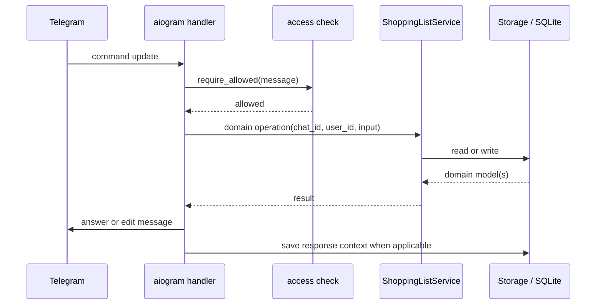
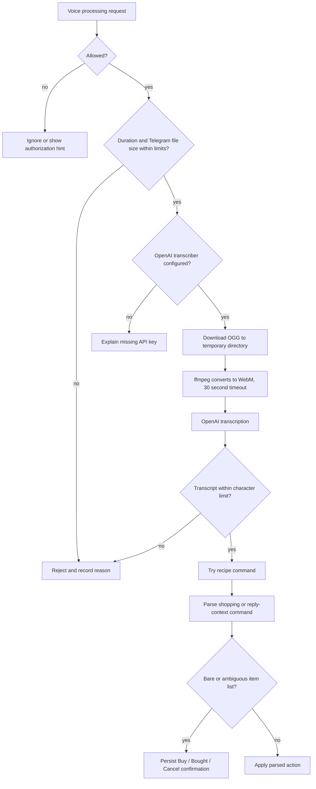

# Request Lifecycle

All Telegram routing is assembled in `build_dispatcher` in
[`telegram_bot.py`](../src/honeybuy_tg/telegram_bot.py). Command handlers are
registered before the generic voice and text handlers, followed by callback
handlers. A metrics middleware wraps messages and callbacks at the router.

## Routing Trace And Owner Lookup

A message outer middleware starts correlation before filters choose a handler
and finalizes diagnostics on normal return, failure, or cancellation. Every
received `Update.message` is in scope, including unsupported media and ignored
text. Edited messages, channel/business posts, callbacks, inline/chosen-inline
updates, membership and reaction updates are excluded; embedded reply or
callback messages are not separate ingress. Messages Telegram never delivers
cannot have a trace.

Finite reasons distinguish parse-mode and authorization gates, recipe markers
and recognizers, shopping AI and deterministic fallback, reply-context routing,
voice rejection and confirmation. AI validation success is separate from a
recognized action. Handler completion alone does not prove a mutation succeeded.
Voice reanalysis belongs to the incoming command's chat and message ID even
when its source is an external reply. Existing gate ordering and routing are
preserved.

The owner can send `/trace 123` or reply to the original incoming message with
`/trace`. The command checks owner identity and current chat authorization
before lookup. It accepts one positive ASCII ID up to `2147483647`, or one
same-chat reply; it rejects both together and external/cross-chat replies.
There is no bot-response-to-request mapping or cross-chat search. Missing and
expired results share a generic response. Output is bounded plain text and
makes no AI request. In an authorized group the reply is visible to the group.

Only closed diagnostic codes and safe revision/model/timing metadata are
recorded. Raw content and arbitrary exceptions are excluded. Trace operations
fail open; request context is always reset. [Persistence](persistence.md)
describes the separate bounded store and the existing raw-content event history.

## Access Control

The configured owner is identified by a matching `OWNER_USER_ID` or a
case-insensitive `OWNER_USERNAME`. If both are configured, either match is
accepted. `ALLOWED_USER_IDS` adds people who may use the bot in private chats.
Group authorization is stored by `chat_id`.

| Context | Who can use ordinary stateful features? | Result |
| --- | --- | --- |
| Private chat | Owner or a user in `ALLOWED_USER_IDS` | Uses that private chat's list |
| Authorized group | Any group member represented by `from_user` | All members share the group's list |
| Unauthorized group | Nobody until the owner runs `/authorize` | Owner receives an authorization hint; other requests are ignored |
| Bot added to a chat | Addition must be performed by the owner | The bot leaves when the actor is not the owner |

`/whoami` is intentionally available without an authorization check so an
operator can discover IDs. `/authorize`, `/clear`, and `/text_parse_mode` are
owner-only. Callback handlers repeat access and, where relevant, owner or
requester checks; a button is not trusted merely because the bot created it.

Authorization is evaluated before list or recipe state is read or mutated. For
tenant-scoped service and storage operations, the tenant key is the Telegram
`chat_id`; category and identity caches are the intentional global exception.

## Cross-Chat Inline Capture

Inline capture lets an eligible user type one item after the bot username in
any Telegram chat, choose a Honeybuy destination, send a generic card, and add
the item only by tapping its explicit confirmation button.

| Stage | Implemented behavior and boundary |
| --- | --- |
| Query validation | Collapse surrounding and repeated whitespace. A blank query or raw/clean query longer than 256 characters returns no results and creates no state. The complete query is one literal item; recipe and shopping parsers are not called and words such as `and` or `и` are not split. |
| Private candidate | Offer `Add to my Honeybuy list` only when the requester currently matches the owner or `ALLOWED_USER_IDS`. The destination is the requester's numeric user ID, not the chat displaying the inline query. When allowed, this is the first result and consumes one of the 50 total result slots. |
| Group candidates | Consider only the first 50 stored authorized groups in stable title/ID order; groups later in that order are not capability-checked or offered even when earlier candidates are ineligible. Stop checking the prefix earlier once the combined picker reaches 50 results. For each considered group, first require the bot's current Telegram status to be administrator, then require the requester to be creator, administrator, member, or a restricted user whose membership flag is true. Failed Telegram lookups exclude the group. |
| Intent batch | Offer no more than 50 destinations in total. An allowed private destination is first, so it can be accompanied by at most 49 groups. Generate a separate opaque token per offered destination and create the complete five-minute intent batch atomically. Persistence caps pending intents at 100 per requester and trims older ones when necessary. A batch failure returns no results and leaves no partial new batch. |
| Picker response | Return personal results with `cache_time=0`. Destination titles are picker metadata only. The sent card contains the literal item and a generic `Confirm add` button, but no destination name, chat ID, or existing list contents. |
| Selection | Sending a result and receiving an optional `chosen_inline_result` update do not mutate a list. There is no chosen-result handler that applies an item. |
| Explicit callback | Require a syntactically valid opaque token, the original requester, and a callback for an inline message rather than an ordinary chat message. Ignore `chat_instance` and visible card text for destination selection. Unknown, expired, wrong-requester, and replayed tokens cannot apply. |
| Initial capability gate | Before normalization, check current private authorization or, for a group, stored authorization, bot administrator status, and requester membership. A failed check leaves an otherwise live intent retryable until it expires. |
| Normalize and final gate | Normalize the single literal item through the ordinary item-identity service. Immediately afterward, repeat the same private/group capability check; loss of access during asynchronous normalization prevents application and leaves an otherwise live intent retryable. |
| Atomic apply | After the final capability gate, take a fresh time and start one storage transaction that rereads the live intent, rechecks its expiry and target, marks it applied, redacts `item_text`, and inserts the shopping item. Expiry during normalization therefore prevents insertion; insert failure rolls back the claim and redaction. |
| Post-commit response | Record an `add`/`inline_capture` shopping metric and edit the inline card to generic success text after the database commit. If that Telegram edit fails, the item stays committed and the applied token still prevents replay. |

This flow does not use `pending_confirmations`, which remains the chat-scoped
store for ambiguous voice and recipe-overwrite callbacks. Inline capture has no
trusted source-chat identity: the expiring intent, requester ID, and current
destination checks carry the authority.

## Direct Shopping Commands

A normal command follows this path:

Important details:

- `/add milk` treats the entire argument after the command as one item. It does
  not split commas or the word `and`; multi-item splitting belongs to natural
  text and voice parsing.
- Add creates a new active row. It does not synchronously enforce an
  active-item uniqueness constraint.
- Remove and bought-by-name operations load active items, fill missing
  identities if needed, and update every exact, substring, or canonical-key
  match.
- ID-based button and reply actions update only a row that is still `active`.
  Repeating the same action therefore returns no updated item.
- Item result messages are saved in `bot_messages` with their row IDs. That is
  what later makes `this`, `это`, and undo replies resolvable.

## Natural Text

The effective parse mode is the chat override from `chat_settings`, or the
`TEXT_PARSE_MODE` environment default:

- `off` ignores all non-command text.
- `mention` parses text containing the bot's username and removes the mention.
- `all` parses every non-command text message.

If a mention-only message replies to an ordinary text message, the replied text
becomes the command source. The bot adds an eyes reaction to handled source and
command messages when Telegram permits it; reaction failure is logged but does
not cancel the action.

Once text passes the gate, processing order is significant:

1. Try deterministic recipe learning, reuse, and alias phrases.
2. If none matches and the text looks recipe-related, optionally ask the AI
   recipe-command parser.
3. If it is not handled as a recipe, try the AI shopping parser when configured.
4. On AI failure, or an AI `unknown` result in the applicable fallback case,
   use the deterministic shopping parser.
5. Resolve undo or pronoun-based reply context.
6. Apply add, remove, bought, or show-list behavior.

Shopping parsing is AI-first when an OpenAI key is configured. Recipe-command
parsing is deterministic-first. An ordinary text parse that remains `unknown`
is silently left unhandled; an explicit parsed clarification is mainly surfaced
through voice handling.

The deterministic shopping parser recognizes selected Russian and English
prefixes, bought suffixes, and show-list phrases. It splits item lists on commas
and on `и` or `and`, normalizes whitespace and `ё`, and filters known politeness
or filler fragments.

## Voice

Voice processing is entered by a direct voice message or by replying to a voice
message with a bot mention, `/reanalyze`, or the unadvertised `/voice` alias.
Telegram may supply the reply target through either `reply_to_message` or
`external_reply`; the code supports both.

The configured pre-transcription checks are duration and Telegram-reported file
size. Transcript length is checked after the paid transcription request. The
temporary audio files are removed on scope exit.

A transcript such as `яйца и масло` has plausible items but no safe action. The
bot stores a pending confirmation and offers `Buy`, `Bought`, and `Cancel`.
Only the original requester may resolve it, and the storage update from
`pending` makes a successful resolution single-use.

Voice commands can use the reply target of the original voice note. This keeps
`это куплено` or an undo request attached to the bot message that the user
actually replied to, even when a later text message asks the bot to reanalyze
the voice.

## Reply Context

Responses for added, removed, bought, list, and shop results may carry tracked
shopping-item IDs. Context commands use those IDs rather than reparsing the
display text.

- An undo phrase uses a replied tracked `added` result when present, otherwise
  the most recent tracked `added` result in the chat.
- A multi-item `added` result can be undone as a batch.
- `this` or `это` may remove or mark bought a tracked single item.
- A non-`added` message with multiple tracked items is ambiguous, so the user
  must name the item.
- Missing or empty tracking data produces an explanatory response instead of a
  name-based guess.

Tracked context is chat-scoped but not user-scoped. Any permitted member of an
authorized group can act on a tracked bot response in that group.

## List Rendering And Shopping Mode

`/list` and `/shop` first call `list_active_deduplicated`. That call can:

1. derive or fetch identities for rows missing a canonical key, plus unstable
   keys when an AI normalizer is configured;
2. persist those identities;
3. choose one row for each canonical key; and
4. soft-remove the other active rows.

Consequently these two apparent reads can mutate the database. If equivalent
rows differ in detail, the duplicate scorer prefers structured quantity/unit
data, then names containing a number or comma, then the longer name.

After deduplication, category lookup uses the global cache. Uncached items are
sent to the optional categorizer; failures leave cached categories intact and
render the rest without requiring the AI result.

`/shop` persists a snapshot of item IDs, rendered text, category, and checked
state for the Telegram message. Tapping `Got` performs two related updates:

- transition the shopping item from active to bought when still possible;
- mark the item checked in that particular shop-session snapshot.

The same Telegram message is then edited with a checkmark and a keyboard that
omits checked items. Old shop sessions are retained and are not automatically
reconciled with later list edits.

## Confirmations And Callback Safety

Two flows use the `pending_confirmations` table:

- ambiguous bare voice items store a JSON list;
- recipe overwrite requests store a typed JSON object with extracted recipe
  data and an expected target digest.

Both verify the callback chat, current status, and requester before applying an
action. Recipe overwrite additionally validates every payload field, atomically
claims the confirmation, and checks that the recipe still has the expected ID,
normalized name, and content digest. The owner-only clear-list confirmation is
lighter-weight and exists only in Telegram callback data; it does not create a
pending-confirmation row.

There is no time-based expiry or cleanup job for confirmations. A resolved row
becomes inactive through its status, while an unresolved row remains pending.

## Failure And Fallback Rules

- AI shopping-parse failure is logged and falls back to the deterministic
  parser.
- AI category failure produces a usable list with only cached or no categories.
- AI identity failure falls back to a local identity, allowing shopping and
  recipe persistence to continue.
- Voice has no fallback for missing OpenAI transcription or `ffmpeg`.
- Recipe learning has no fallback for missing OpenAI extraction, an unreadable
  URL, invalid model output, or an empty extracted ingredient list.
- Telegram reaction failure is non-fatal. Most message-send failures occur
  after the underlying data operation and therefore do not roll it back.
- Event rows are written only on selected paths. Consult both journald/process
  logs and `events`; neither by itself is a complete request ledger.
